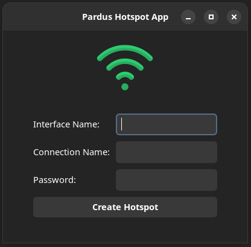
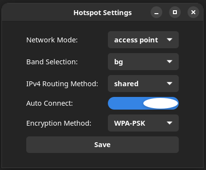

# Pardus Hotspot Application

Pardus Hotspot Application allows users to easily set up a Wi-Fi hotspot with a user-friendly interface.   
With just a few inputs, users can create a secure connection and share it with
other devices.   

