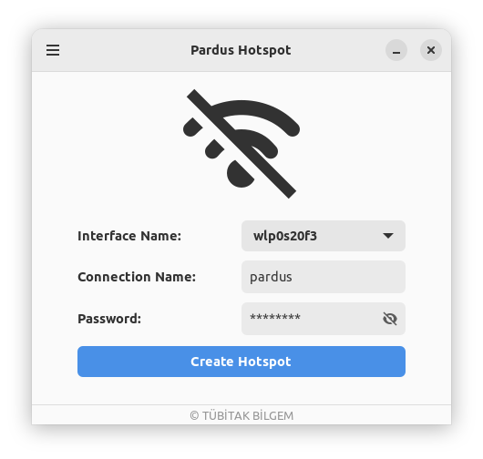
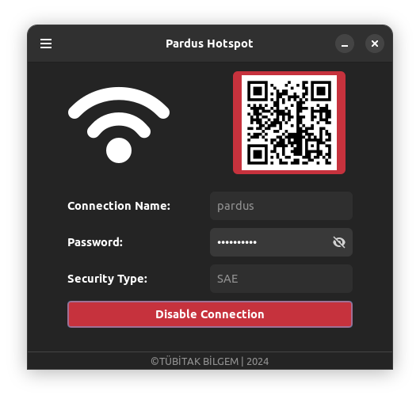
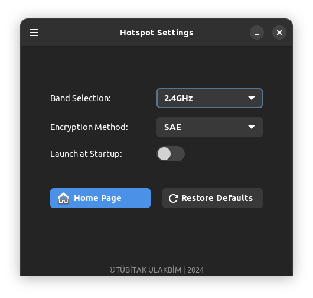

# Pardus Hotspot

[](LICENSE)  

[🇹🇷](./README_TR.md) | [🇬🇧](./README.md)

## Introduction
Pardus Hotspot is a Linux application that helps you easily create and manage a Wi-Fi hotspot on your computer.
With its simple interface, you can quickly set up and share your internet connection with other devices.

## Features
- User-friendly interface
- Support for both 2.4GHz and 5GHz frequency bands
- WPA2 (WPA-PSK) and WPA3 (SAE) security protocols
- QR code generation for easy connection sharing
- System tray integration
- Automatic configuration saving
- Autostart capability

## Installation

### Requirements
Before installing Pardus Hotspot, ensure your system meets the following requirements:

- `network-manager`: The application relies on NetworkManager for managing network connections.
- `python3`: Pardus Hotspot is built with Python 3
- `python3-dbus`: Required for the application to interact with NetworkManager.
- `libgtk-3-dev` & `libglib2.0-dev`: Required for the graphical interface.
- `gir1.2-ayatanaappindicator3-0.1`: Used for creating a system tray icon.
- `python3-gi`: Allows Python to use GTK and GNOME libraries.
- `gir1.2-gtk-3.0`: Provides the library for building windows and buttons.
- `gir1.2-gdkpixbuf-2.0`: Enables showing images, like QR codes.
- `python3-qrcode`: Used to create QR codes.
- `python3-pil` / `python3-pillow`: Helps handle images needed for QR codes.

### Usage

  - __From Package Manager__
    ```bash
    sudo apt install pardus-hotspot
    ```
  - __From Source__
    ```
    # Clone the repository
    git clone https://github.com/pardus/pardus-hotspot

    # Navigate to the project directory
    cd pardus-hotspot

    # Install dependencies
    sudo apt install network-manager python3 python3-dbus libgtk-3-dev libglib2.0-dev \
        gir1.2-ayatanaappindicator3-0.1 python3-gi gir1.2-gtk-3.0 \
        gir1.2-gdkpixbuf-2.0 python3-qrcode python3-pil

    # Run the application
    python3 Main.py

    ```

### Usage Guide

 ##### Creating a Hotspot

  1. Launch the application
  2. Enter a connection name (SSID)
  3. Set a password (minimum 8 characters)
  4. Select your wireless interface (interfaces are detected automatically)
  5. Click to "Create Hotspot"

 ##### Advanced Settings

  - __Band Selection__: Choose between 2.4GHz and 5GHz bands
  - __Security Protocol__: Select WPA2 (WPA-PSK) or WPA3 (SAE).
  - __Autostart__: Enable/disable automatic startup with system
  > __Note__: For Apple products, select **SAE** for the encryption method.


##### QR Code Sharing
Once the hotspot is active, a scannable QR code automatically appears for easy connection sharing with mobile devices.


## Interface
- Application interface for active/inactive connection states:

<p align="center">
  
  
</p>

 - Settings configuration:
 <p align= "center">

</p>

