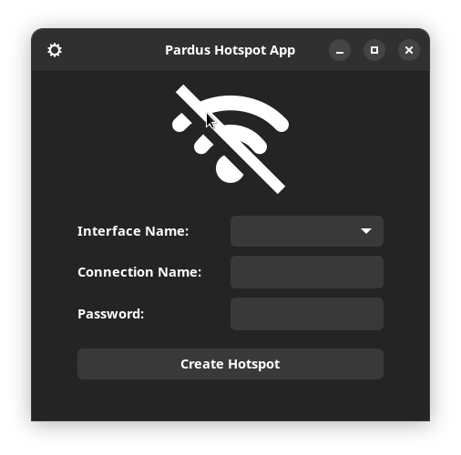
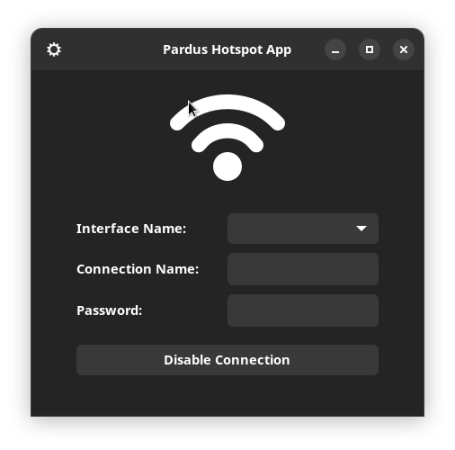
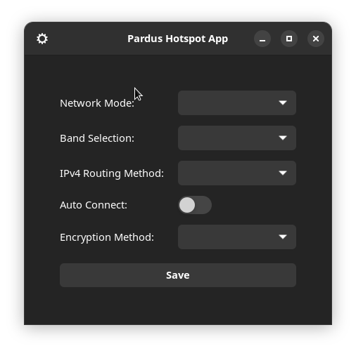

# Pardus Hotspot Application

## Introduction
This application is designed for Linux systems, providing a straightforward way
for users to effortlessly create and manage a Wi-Fi hotspot.
Featuring a graphical interface, it facilitates the configuration and management of network settings with ease.

## Installation

### Prerequisites
- Ensure you have NetworkManager and Python 3.x installed on your system.
- D-Bus Python bindings are required for the application to interact with NetworkManager.

### Usage
- Clone the repository:

    ```
    git clone https://git.pardus.net.tr/emel.ozturk/pardus-hotspot-app.git
    ```

- To start the application, run:
    `python3 Main.py`

### Interface

When the hotspot is not active:



When the hotspot is active:



Settings configuration:



### Hotspot Configuration
- The interface allows for setting the SSID, connection name, password, and other network-related configurations.

## Developer Notes
`MainWindow.py` acts as the entry point of the application. It utilizes
`hotspot.py` for the underlying logic to interact with the system's network
management.
`network_utils.py` is used for operations such as listing the available Wi-Fi
cards in the computer and getting the Wi-Fi's status.

## To-Dos
- [x] Implement dynamic retrieval of network interfaces.
- [x] Stack page for important errors
- [ ] Add support for different encryption methods.
- [ ] Introduce a feature to save and load preset configurations.
- [x] Improve error handling and user feedback.
- [ ] Check if app is working on a virtual machine
- [ ] Add a connection status label
- [x] Check if the Wi-Fi is on or off
- [ ] Check how many devices are connected to the hotspot
- [ ] Show connected device infos
- [x] Enable connection for iPhones
- [ ] ADD QR feature
- [x] Automatically disable connection if Wi-Fi signal lost
- [ ] Add hidden parameter to show hotspot connection or not (only specific
  devices allowed)
