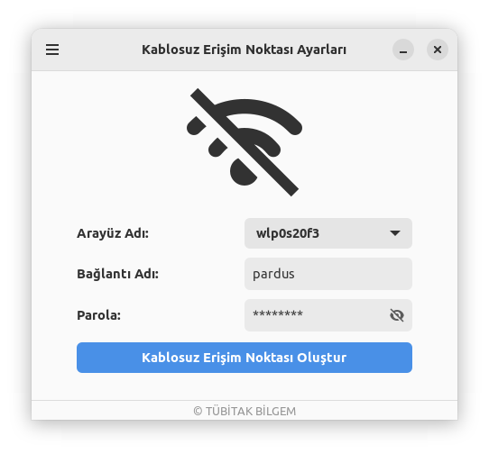
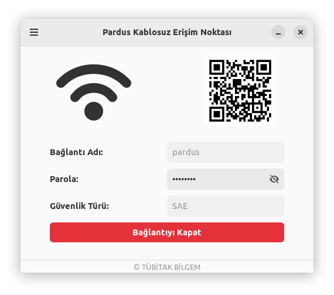
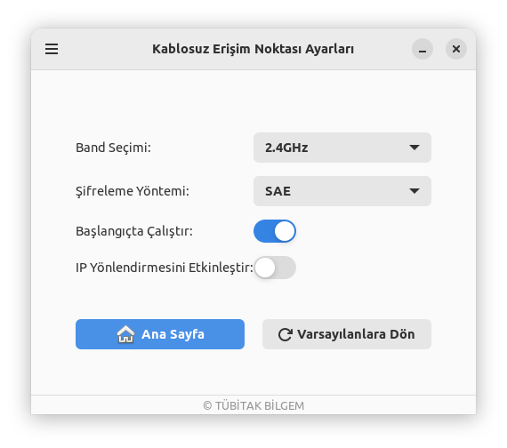

# Pardus Kablosuz Erişim Noktası

[](LICENSE)  

[🇹🇷](./README_TR.md) | [🇬🇧](./README.md)


## Giriş
Pardus Hotspot, bilgisayarınızda kolayca bir Wi-Fi hotspot oluşturmanıza ve yönetmenize yardımcı olan bir Linux uygulamasıdır. Basit arayüzü sayesinde, internet bağlantınızı diğer cihazlarla hızlı bir şekilde paylaşabilirsiniz.

## Özellikler
- Kullanıcı dostu arayüz
- 2.4GHz ve 5GHz frekans bant desteği
- WPA2 (WPA-PSK) ve WPA3 (SAE) güvenlik protokolleri
- Kolay bağlantı paylaşımı için QR kodu oluşturma
- Sistem tepsisi entegrasyonu
- Otomatik yapılandırma kaydetme
- Otomatik başlatma özelliği

## Kurulum

### Önkoşullar
Pardus Kablosuz Erişim Noktası'nı kurmadan önce, sisteminizin aşağıdaki gereksinimleri karşıladığından emin olun:

- `network-manager`: Uygulama, ağ bağlantılarını yönetmek için NetworkManager'a bağlıdır.
- `python3`: Pardus Kablosuz Erişim Noktası, Python 3 ile geliştirilmiştir.
- `python3-dbus`: Uygulamanın NetworkManager ile etkileşime geçebilmesi için gereklidir.
- `libgtk-3-dev` & `libglib2.0-dev`: Grafik arayüzü için gereklidir.
- `gir1.2-ayatanaappindicator3-0.1`: Sistem tepsisi ikonu oluşturmak için kullanılır.
- `python3-gi`: Python'un GTK ve GNOME kütüphanelerini kullanmasını sağlar.
- `gir1.2-gtk-3.0`: Pencere ve butonları oluşturmak için gerekli kütüphaneyi sağlar.
- `gir1.2-gdkpixbuf-2.0`: QR kodları gibi resimleri görüntülemeyi sağlar.
- `python3-qrcode`: QR kodları oluşturmak için kullanılır.
- `python3-pil` / `python3-pillow`: QR kodları için gerekli olan resimlerin işlenmesine yardımcı olur.

### Kullanım
  - __Paket Yöneticisi ile__
    ```bash
    sudo apt install pardus-hotspot
    ```
  - __Kaynak Koddan__
    ```
    # Depoyu klonlayın
    git clone https://github.com/pardus/pardus-hotspot

    # Klonlanan dizine gidin
    cd pardus-hotspot

    # Bağımlılıkları indirin
    sudo apt install network-manager python3 python3-dbus libgtk-3-dev libglib2.0-dev \
        gir1.2-ayatanaappindicator3-0.1 python3-gi gir1.2-gtk-3.0 \
        gir1.2-gdkpixbuf-2.0 python3-qrcode python3-pil

    # Uygulamayı çalıştırın
    python3 Main.py

    ```

### Kullanma Rehberi

 ##### Kablosuz Erişim Noktası Oluşturma

  1. Uygulamayı başlatın
  2. Bir bağlantı adı (SSID) girin
  3. Bir parola belirleyin (en az 8 karakter)
  4. Kablosuz arayüzünüzü seçin (arayüzler otomatik olarak algılanır)
  5. "Hotspot Oluştur" butonuna tıklayın

##### Gelişmiş Ayarlar

 - __Bant Seçimi__: 2.4GHz ve 5GHz bantları arasında seçim yapın
 - __Güvenlik Protokolü__: WPA2 (WPA-PSK) veya WPA3 (SAE) seçin.
 - __Otomatik Başlat__: Sistemle birlikte otomatik başlatmayı etkinleştirin/devre dışı bırakın
 - __Ip Forwarding__: Docker kuruluysa veya bağlantı sorunları yaşıyorsanız etkinleştirin. Bu seçenek açıldığında, uygulama IP yönlendirmeyi otomatik yapılandırmak için root yetkisi gerektiren bir alt işlem çalıştıracaktır.

> __Notlar:__
    - Apple ürünleri için şifreleme yöntemi olarak **SAE** seçin. Eğer bağlantı diğer cihazlarda görünmüyorsa, **WPA-PSK**'ya geçmeyi deneyin.
    - Linux sistemlerindeki sınırlamalar nedeniyle **2.4GHz** modu önerilir.

##### QR Kod Paylaşımı
  Hotspot etkin hale geldiğinde, mobil cihazlarla kolay bağlantı paylaşımı için taranabilir bir QR kodu otomatik olarak görünür.

## Arayüz
 - Aktif / pasif bağlantılar için uygulama arayüzü:


<p align="center">
  
  
</p>

- Ayarların yapılandırılması:
<p align="center">

</p>