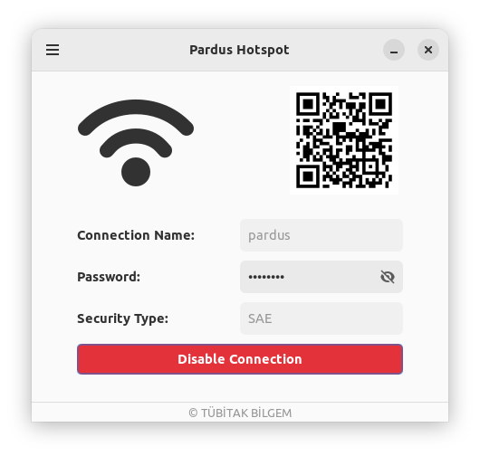
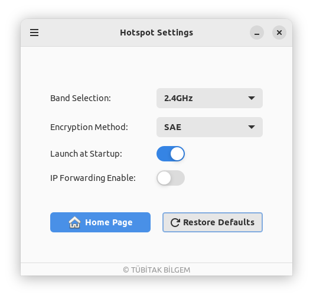

[🇹🇷](./README_TR.md) [🇬🇧](./README.md)

# Pardus Kablosuz Erişim Noktası

## Giriş
Bu uygulama, Linux sistemleri için tasarlanmıştır ve kullanıcıların Wi-Fi hotspot'u kolayca oluşturup yönetmelerini sağlar.
Grafik arayüzü sayesinde ağ ayarlarının yapılandırılmasını ve yönetimini kolaylaştırır.

## Kurulum

### Önkoşullar
Pardus Kablosuz Erişim Noktası'nı kurmadan önce, sisteminizin aşağıdaki gereksinimleri karşıladığından emin olun:

- `network-manager`: Uygulama, ağ bağlantılarını yönetmek için NetworkManager'a bağlıdır.
- `python3`: Pardus Kablosuz Erişim Noktası, Python 3 ile geliştirilmiştir; sistemde Python 3.x'in yüklü olduğundan emin olun.
- `python3-dbus`: Uygulamanın NetworkManager ile etkileşime geçebilmesi için gereklidir.
- `libgtk-3-dev` ve `libglib2.0-dev`: Grafik arayüzü için gereklidir.
- `gir1.2-ayatanaappindicator3-0.1`: Sistem tepsisi ikonu oluşturmak için kullanılır.

### Kullanım
- Depoyu klonlayın ve klonlanan dizine gidin:

    ```
    git clone https://git.pardus.net.tr/emel.ozturk/pardus-hotspot.git
    cd pardus-hotspot
    ```

- Uygulamayı başlatın:
  ```
  python3 Main.py
  ```

### Arayüz

Hotspot aktif değilken:


Hotspot aktifken:



Ayarların yapılandırılması:




## Geliştirici Notları
`MainWindow.py`, uygulamanın giriş noktası olarak işlev görür. Sistemin ağ yönetimiyle etkileşim kurmak için `hotspot.py` kullanılır.
`network_utils.py`, bilgisayarda bulunan Wi-Fi kartlarını listeleme ve Wi-Fi durumunu kontrol etme gibi işlemler için kullanılır.
`hotspot_settings.py:` başlangıçta otomatik başlatma, son bağlantı bilgilerini
kaydetme gibi işlevsellikleri yönetmek için kullanılır.

___
## Yapılacaklar
- [x] Ağ arayüzlerinin dinamik olarak alınması
- [x] Önemli hatalar için stack sayfası
- [x] Farklı şifreleme yöntemleri için destek ekleme
- [x] Hata yönetimi ve kullanıcı geri bildirimlerini geliştirme
- [x] Wi-Fi'nin açık olup olmadığını kontrol etme
- [x] iPhone'lar için bağlantıyı etkinleştirme
- [x] Wi-Fi sinyali kaybolduğunda bağlantıyı otomatik olarak devre dışı bırakma
- [x] Kullanıcı, hotspot penceresini kapatmak istediğinde bağlantıyı kaldırma
- [x] Tam ekran modunu devre dışı bırakma
- [x] Hakkında ve ayarlar butonları arasında geçiş yaparken oluşan donma
  sorununu düzeltme
- [x] Uygulamanın başlangıçta otomatik açılması
- [ ] Uygulamanın sanal makinede çalışıp çalışmadığını kontrol etme
- [ ] Hotspota bağlı cihaz sayısını kontrol etme
- [ ] Bağlı cihaz bilgilerini gösterme
- [ ] Gizli parametre ekleme (sadece belirli cihazlara hotspot bağlantısını gösterme)
- [ ] QR özelliği ekleme

__NOT :__ GitHub'a uygulama eklenirken __Yapılacaklar__ kısmını silelim,
__URL__'i güncelleyelim.
